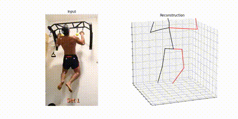
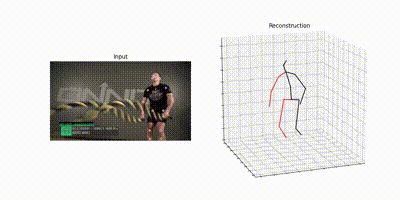

# SSTRAC: Skeleton-based Spatio-Temporal Transformer for Repetition Action Counting
[](https://github.com/996icu/996.ICU/blob/master/LICENSE)

This repository is the official implementation for our paper: ` "SSTRAC: Skeleton-based Spatio-Temporal Transformer for Repetition Action Counting" (Working title) `

### Repetition Counting with PCT
<p align="center">
    
    
</p>


---
## Update ✅

- [2024-1-8]: Our repository is now continually updated!
---
## Overview 💡

### Introduction 

Repetitive actions are very common on our life but the related research is still motivated. Although `Repcount Datasets`, including long videos, have been released from `TransRAC` to improve the degradation of repetitive action counting models, it cannot be denied that there are still some heuristic problems. These Heuristic results occur, especially when the person is hidden by an exercising rack or other object or more than two people are shown in videos, even if real person counts repetitive actions. In addition, when using the transformer model like ViT, it is difficult to augment the data arbitrarily related to given datasets, even though performance & generalization are achieved only when learning through the large dataset. Therefore, we propose the **Spatio-Temporal Transformer Architecture with Skeletons and Learnable parameters** to encode the temporal information more efficiently in counting human repetitive actions by using skeleton to overcome dataset size constraints and further develop color-independent model. 


### Dataset 💽

<table rule='none' align = 'center'>
    <tr>
        <td>
            <center>
                <strong>2D Repcount-A</strong>
            </center>
        </td>
        <td>
            <center>
                
            </center>
        </td>
        <td>
            <center>
                
            </center>
        </td>
    </tr>
    <tr>
        <td>
            <center>
                <strong>3D Repcount-A</strong>
            </center>
        </td>
        <td>
            <center>
                
            </center>
        </td>
        <td>
            <center>
                
            </center>
        </td>
    </tr>
</table>

#### Dataset Summary

We have carefully sorted out clear videos, which contain only single person & full-view so that it could be adjusted in other skeleton models, such as Human poses as Compositional Tasks[1] and VideoPose3D[2], etc. In conclusion, we are able to build a dataset consisting of about 500 videos. This set is used for training our model.

### Result

If you follow up the link, you could download the pretrained-weight.

|Model|MAE|OBO|
|------|:---:|:---:|
|[2D_Base](https://github.com/imjjun/SSTRAC/)|0.438|0.2878|
|[2D_Large](https://github.com/imjjun/SSTRAC/)|**0.407**|**0.303**|
|[3D_Base](https://github.com/imjjun/SSTRAC/)|0.729|0.1509|
|[3D_Large](https://github.com/imjjun/SSTRAC/)|0.658|0.226|

---
## How to Use 🙋🏻‍♂️

More detailed explanation could be referred to [Quickstart.md](./docs/Quickstart.md). You could install this model with this docs.

### Train

```
# You could make your configuration on train.py
# You might need to set your dataset path.

python train.py
```

### Test
```
# You could make your configuration on test.py
# You might need to set your dataset path.

python test.py
```

### Custom Video

Please refer to [Inference.md](./docs/Inference.md).

---
## Citation 📚

```
@misc{DSTRAC,
	author = {...},
	title = {SSTRAC: Skeleton-based Spatio-Temporal Transformer for Repetition Action Counting},
	booktitle = {...},
	year = {2024}
    ...}
```
[1] If you use 2D Repcount-A Dataset, please also cite:
```
@inproceedings{Geng23PCT,
	author={Zigang Geng and Chunyu Wang and Yixuan Wei and Ze Liu and Houqiang Li and Han Hu},
	title={Human Pose as Compositional Tokens},
	booktitle={{CVPR}},
	year={2023}, 
}
```
[2] If you use 2D Repcount-A Dataset, please also cite:
```
@inproceedings{pavllo:videopose3d:2019,
  title={3D human pose estimation in video with temporal convolutions and semi-supervised training},
  author={Pavllo, Dario and Feichtenhofer, Christoph and Grangier, David and Auli, Michael},
  booktitle={Conference on Computer Vision and Pattern Recognition (CVPR)},
  year={2019}
}
```
