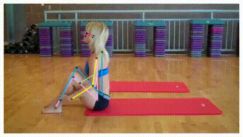
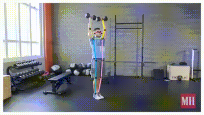

# SSTRAC: Skeleton-based dual-stream Spatio-Temporal Transformer for Repetitive Action Counting in Videos
[](https://github.com/996icu/996.ICU/blob/master/LICENSE)

This repository is the official implementation for our paper: ` "SSTRAC: Skeleton-based dual-stram Spatio-Temporal Transformer for Repetitive Action Counting in Videos" `

### Repetition Counting with PCT
<p align="center">
    
    
</p>


---
## Update ✅

- [2025-7-12]: Our repository is now continually updated!
---
## Overview 💡

### Introduction 

Most existing approaches to counting repetitive action in videos focus on improving model accuracy, while overlooking important issues such as model efficiency and robustness to occlusion of human body parts in videos. To achieve model efficiency while simultaneously handling human occlusion in videos, we propose a novel network called Skeleton-based dual-stream Spatio-temporal Transformer for Repetitive Action Counting (SSTRAC) using videos, which reconstructs defective human skeletons as a preprocessing step, and then encodes the spatial and temporal information of human actions into our model with fewer parameters. We performed extensive experiments by comparing the proposed model with other recent state- of-the art models. The experimental results demonstrate the superiority of our model in terms of efficiency and robustness to occlusion of human body parts in videos. Codes and models are available at https://github.com/imjjun/SSTRAC_public/tree/main


### Dataset 💽

<table rule='none' align = 'center'>
    <tr>
        <td>
            <center>
                <strong>2D Repcount-A</strong>
            </center>
        </td>
        <td>
            <center>
                
            </center>
        </td>
        <td>
            <center>
                
            </center>
        </td>
    </tr>
</table>

#### Dataset Summary

We have carefully sorted out clear videos, which contain only single person & full-view so that it could be adjusted in other skeleton models, such as Human poses as Compositional Tasks[1] and VideoPose3D[2], etc. In conclusion, we are able to build a dataset consisting of about 500 videos. This set is used for training our model.

### Result

If you follow up the link, you could download the pretrained-weight with augmentation. 

|Model|MAE|OBO|
|------|:---:|:---:|
|[Base](https://drive.google.com/file/d/1otbdk9Rz1VbJcUvaYaXx8DHLWPGyNUT7/view?usp=sharing)|0.394|0.311|
|[Large](https://drive.google.com/file/d/1CgaJOLevghtapPui3vTn9r4i9DKG8hMY/view?usp=drive_link)|**0.373**|**0.311**|

---
## How to Use 🙋🏻‍♂️

More detailed explanation could be referred to [Quickstart.md](./docs/Quickstart.md). You could install this model with this docs. This code would be released after publish.

### Train

```
# You could make your configuration on train.py
# You might need to set your dataset path.

python train.py
```

### Test
```
# You could make your configuration on test.py
# You might need to set your dataset path.

python test.py
```

### Custom Video

Please refer to [Inference.md](./docs/Inference.md).

---
## Citation 📚

```
@misc{DSTRAC,
	author = {...},
	title = {SSTRAC: Skeleton-based Spatio-Temporal Transformer for Repetition Action Counting},
	booktitle = {...},
	year = {2024}
    ...}
```
[1] If you use 2D Repcount-A Dataset, please also cite:
```
@inproceedings{Geng23PCT,
	author={Zigang Geng and Chunyu Wang and Yixuan Wei and Ze Liu and Houqiang Li and Han Hu},
	title={Human Pose as Compositional Tokens},
	booktitle={{CVPR}},
	year={2023}, 
}
```
[2] If you use 2D Repcount-A Dataset, please also cite:
```
@inproceedings{pavllo:videopose3d:2019,
  title={3D human pose estimation in video with temporal convolutions and semi-supervised training},
  author={Pavllo, Dario and Feichtenhofer, Christoph and Grangier, David and Auli, Michael},
  booktitle={Conference on Computer Vision and Pattern Recognition (CVPR)},
  year={2019}
}
```
