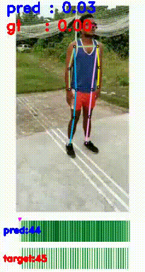
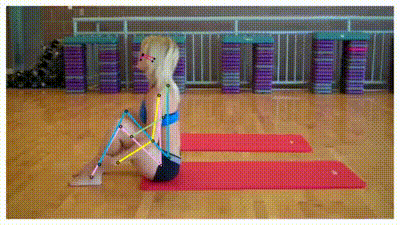
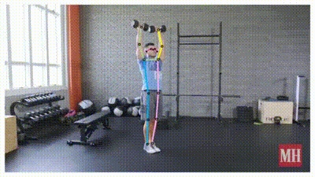

# SSTRAC: Skeleton-based dual-stream Spatio-Temporal Transformer for Repetitive Action Counting in Videos
[](https://github.com/996icu/996.ICU/blob/master/LICENSE)

This repository is the official implementation for our paper: ` "SSTRAC: Skeleton-Based Dual-Stream Spatio-Temporal Transformer for Repetitive Action Counting in Videos" `

### Repetition Counting with PCT
<p align="center">
    
    
</p>


---
## Update ✅

- [2025-9-12]: Our repository is now updated! We are preparing the research article to release our full codes immediately.
- [2025-9-12]: Our paper is finally published on ` IEEE ACCESS `! The paper is available at (https://ieeexplore.ieee.org/document/11214137?denied=)
---
## Overview 💡

### Introduction 

Most existing approaches to predicting the number of repetitive actions in videos focus on improving model accuracy, but overlook important issues such as robustness to changes in human body size and and occlusion of human body parts in videos. To achieve robustness to changes in human size and and occlusion of human body in videos, we propose a novel network, Skeleton-based dual-stream Spatio-temporal Transformer for Repetitive Action Counting (SSTRAC) using videos, which reconstructs defective human skeletons as a preprocessing step, and then encodes the spatial and temporal information of repetitive actions into the per-frame embeddings through the dual-stream spatio-temporal transformer. To capture both high and low frequency actions in short and long videos, the per-frame embeddings are abstracted in the form of a multi-scale self-attention matrix. In the final step, the period predictor estimates a density map, which provides the number of repetitive actions in each video. We performed extensive experiments by comparing the proposed model with other recent state-of-the art models. The experimental results demonstrate the superiority of our model in terms of robustness to changes in human size and occlusion of human body parts in videos. Codes and models are available at https://github.com/imjjun/SSTRAC_public


### Dataset 💽

<table rule='none' align = 'center'>
    <tr>
        <td>
            <center>
                <strong>2D Repcount-A</strong>
            </center>
        </td>
        <td>
            <center>
                
            </center>
        </td>
        <td>
            <center>
                
            </center>
        </td>
    </tr>
</table>

#### Dataset Summary 

We have carefully sorted out clear videos, which contain only single person & full-view so that it could be adjusted in other skeleton models, such as Human poses as Compositional Tasks[1]. In conclusion, we are able to build a dataset consisting of about 500 videos. This dataset is used for training our model.

### Result

|Model|MAE|OBO|
|------|:---:|:---:|
|Base|0.394|0.312|
|Large|**0.373**|**0.312**|

---
## How to Use 🙋🏻‍♂️

More detailed explanation could be referred to Quickstart.md. You could install this model with this docs.

### Project Structure
- `SSTRAC/` - Full codes of Our Model: SSTRAC
- `train.py` - Configuration and Execution for training our model
- `test.py` - Configuration and Execution for evaluating our model
- `infer_custom.py` - Customized Inference
- `video2pct` - Convert naive videos into keypoint sequences

### Train

```
# You could make your configuration on train.py
# You might need to set your dataset path.

python train.py
```

### Test
```
# You could make your configuration on test.py
# You might need to set your dataset path.

python test.py
```

### Custom Video

Please refer to Inference.md.

---
## Citation 📚

```
@ARTICLE{11214137,
  author={Lim, Jungjun and Kang, Donghoon and Ryu, Kanghyun and Hyeong Hong, Je},
  journal={IEEE Access}, 
  title={SSTRAC: Skeleton-Based Dual-Stream Spatio-Temporal Transformer for Repetitive Action Counting in Videos}, 
  year={2025},
  volume={13},
  number={},
  pages={184046-184058},
  keywords={Videos;Skeleton;Transformers;Robustness;Data models;Predictive models;Cameras;Art;Solid modeling;Silicon;Repetitive action counting;skeleton;human size;occlusion;spatio-temporal;multi-scale;density map},
  doi={10.1109/ACCESS.2025.3624029}}
```
[1] If you use 2D Repcount-A Dataset, please also cite:
```
@inproceedings{hu2022transrac,
  title={TransRAC: Encoding Multi-scale Temporal Correlation with Transformers for Repetitive Action Counting},
  author={Hu, Huazhang and Dong, Sixun and Zhao, Yiqun and Lian, Dongze and Li, Zhengxin and Gao, Shenghua},
  booktitle={Proceedings of the IEEE/CVF Conference on Computer Vision and Pattern Recognition},
  pages={19013--19022},
  year={2022}
}
```
[2] If you use 2D Repcount-A Dataset, please also cite:
```
@inproceedings{Geng23PCT,
	author={Zigang Geng and Chunyu Wang and Yixuan Wei and Ze Liu and Houqiang Li and Han Hu},
	title={Human Pose as Compositional Tokens},
	booktitle={{CVPR}},
	year={2023}, 
}
```
